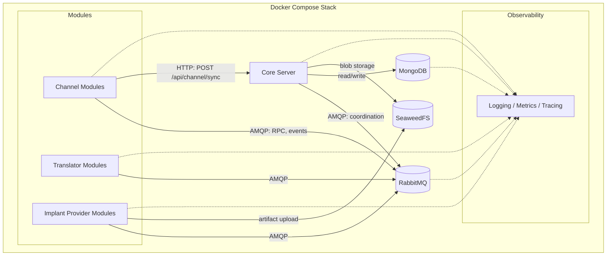

# Основна інфраструктура

Ця сторінка описує інфраструктурні сервіси, що забезпечують роботу платформи Vibe C2 у межах MVP. Для кожного сервісу визначено його роль, причину вибору та зв'язки з іншими компонентами.

Архітектурне обґрунтування див. у [Чернетці архітектури](architecture.md). Відповідальності основного сервера описано в [Основних відповідальностях](core-responsibilities.md).

## Топологія інфраструктури

## RabbitMQ — Шина повідомлень

- **Роль**: асинхронний backbone комунікації між основним сервером та всіма модулями. Передає RPC площини управління (наприклад, CRUD профілів обфускації), сповіщення про події та повідомлення координації модулів. **Не** передає трафік імплантів — той проходить через HTTP-ендпоінт синхронізації.
- **Чому RabbitMQ**: зрілий AMQP-брокер з патернами маршрутизації exchange/queue, що підходять для маршрутизації за типом модуля, dead-letter чергами для надійності ([FR-05](tech-requirements.md)) та ACL на рівні черг для контролю меж довіри.
- **З'єднання**: Core Server (publisher/consumer), Channel Modules, Translator Modules, Implant Provider Modules — усі взаємодіють через AMQP.

## MongoDB — Рівень персистентності

- **Роль**: довготривале сховище для облікових записів операторів, реєстрацій агентів, історії задач, стану сесій, журналів аудиту та YAML-документів профілів обфускації.
- **Чому MongoDB**: гнучка до схеми документна модель добре відповідає зберіганню YAML-профілів та напівструктурованих даних аудиту/подій. Підтримує еволюцію MVP-контрактів без жорстких міграцій схеми.
- **З'єднання**: Core Server є основним клієнтом читання/запису.

!!! note
    MongoDB вирішує питання вибору двигуна бази даних, яке зазначено як відкладене рішення в
    [Чернетці архітектури](architecture.md).

## SeaweedFS — Блобове сховище

- **Роль**: розподілене об'єктне/блобове сховище для великих артефактів — результатів збірки імплантів від [Implant Provider Modules](module-types.md), підготовлених payload-ів та результатів ексфільтрації файлів.
- **Чому SeaweedFS**: легковісний, self-hosted, S3-сумісний API. Не залежить від зовнішніх хмарних сервісів та зберігає бінарні блоби окремо від документної бази даних.
- **З'єднання**: Core Server (читання/запис), Implant Provider Modules (завантаження артефактів).

## Docker Compose — Оркестрація розгортання

- **Роль**: визначає та запускає повну топологію сервісів MVP як єдиний декларативний стек. Усі сервіси — основний сервер, RabbitMQ, MongoDB, SeaweedFS, модулі, спостережуваність — працюють як контейнери під управлінням Compose.
- **Чому Docker Compose**: відповідає обмеженню [tech-requirements.md](tech-requirements.md) ("Runtime architecture is containerized and orchestrated with Docker Compose for MVP"). Просте розгортання на одному хості без складності Kubernetes.
- **Топологія**: єдиний `docker-compose.yml` у внутрішній Docker-мережі. Зовнішній доступ обмежений портами оператора/API та портами слухачів каналів, опціонально за зворотним проксі для TLS-термінації (див. [Чернетку архітектури](architecture.md)).

## Стек спостережуваності

- **Роль**: централізований збір логів, метрик та трейсів з усіх сервісів. Підтримує вимоги аудиту ([FR-09](tech-requirements.md)) та цілі операційної надійності.
- **Компоненти**: агрегація структурованих логів, збір метрик та розподілене трасування. Конкретні інструменти (наприклад, Prometheus, Grafana, Loki) поки не визначені — цей розділ описує роль, а не реалізацію.
- **З'єднання**: усі сервіси генерують структуровані логи та сигнали стану. Core Server та модулі надають ендпоінти health/metrics. Стек спостережуваності збирає дані з усіх контейнерів.

## Зведення комунікацій між сервісами

| Від | До | Протокол | Призначення |
|---|---|---|---|
| Core Server | RabbitMQ | AMQP | Координація модулів, RPC, події |
| Channel Modules | RabbitMQ | AMQP | RPC управління профілями, публікація подій |
| Translator Modules | RabbitMQ | AMQP | Координація перекладу |
| Implant Providers | RabbitMQ | AMQP | Координація збірки |
| Channel Modules | Core Server | HTTP | Синхронізація імплантів (`POST /api/channel/sync`) |
| Core Server | MongoDB | MongoDB wire protocol | Персистентність стану, журнали аудиту |
| Core Server | SeaweedFS | HTTP (S3-compatible) | Зберігання та отримання артефактів |
| Implant Providers | SeaweedFS | HTTP (S3-compatible) | Завантаження артефактів |
| Усі сервіси | Observability | Structured logs / metrics | Моніторинг та аудит |
