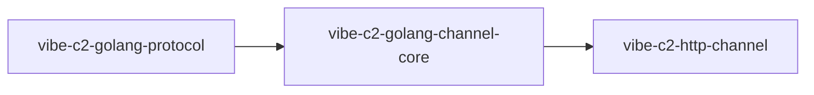

# Golang Packages

This section tracks official Go packages in the Vibe C2 ecosystem.

## Available Packages

- [`vibe-c2-golang-protocol`](golang-package-protocol.md)
- [`vibe-c2-golang-channel-core`](golang-package-channel-core.md)
- [`vibe-c2-http-channel`](golang-package-http-channel.md)
- `vibe-c2-telegram-channel` (new module, docs page pending)

## Package Relationship

## Notes

- These packages are the base for community module development.
- Target UX: contributors should build new channel modules with minimal boilerplate.
