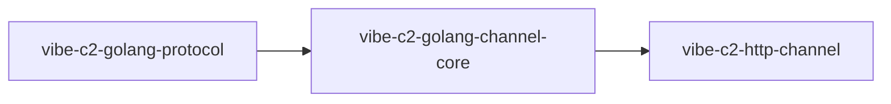

# Golang Packages

This page tracks the first official Go packages in the Vibe C2 ecosystem.

## 1) `vibe-c2-golang-protocol`

Repository: `https://github.com/vibe-c2/vibe-c2-golang-protocol`

Go module:

```bash
go get github.com/vibe-c2/vibe-c2-golang-protocol@v0.1.0
```

Purpose:

- canonical message contracts for channel <-> C2 communication
- shared constants (`inbound.agent_message`, `outbound.agent_message`, version)
- validation helpers and typed validation errors

Current status:

- released version: `v0.1.0`
- available via Go module ecosystem (`proxy.golang.org`)

---

## 2) `vibe-c2-golang-channel-core`

Repository: `https://github.com/vibe-c2/vibe-c2-golang-channel-core`

Go module:

```bash
go get github.com/vibe-c2/vibe-c2-golang-channel-core@v0.1.0
```

Purpose:

- reusable channel runtime SDK for module authors
- transport envelope abstraction (`id` + `encrypted_data` handling)
- profile model/parsing/validation primitives
- sync client to C2 endpoint (`POST /api/channel/sync`)
- management RPC scaffolding for profile operations

Current status:

- released version: `v0.1.0`
- integrated into first module: `vibe-c2-http-channel`

---

## Package Relationship



## Notes

- These packages are the base for community module development.
- Target UX: contributors should build new channel modules with minimal boilerplate.
