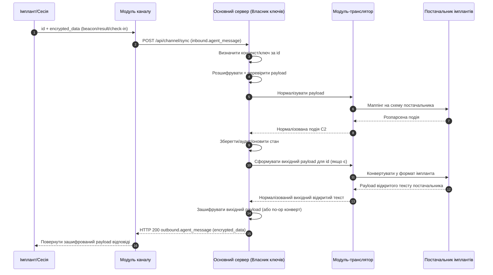

# Потік повідомлень (повна система)

Ця сторінка документує наскрізний потік через усі основні компоненти:

- Імплант/Сесія
- Модуль каналу
- Основний сервер
- Модуль-транслятор
- Модуль постачальника імплантів

## Наскрізна послідовність

## Примітки

- `імплант/сесія ↔ ядро C2` — це логічна протокольна розмова.
- Канал є транспортним ретранслятором і залишається "сліпим" до відкритого тексту.
- Транслятор та Постачальник імплантів є внутрішніми шарами обробки на стороні ядра.
