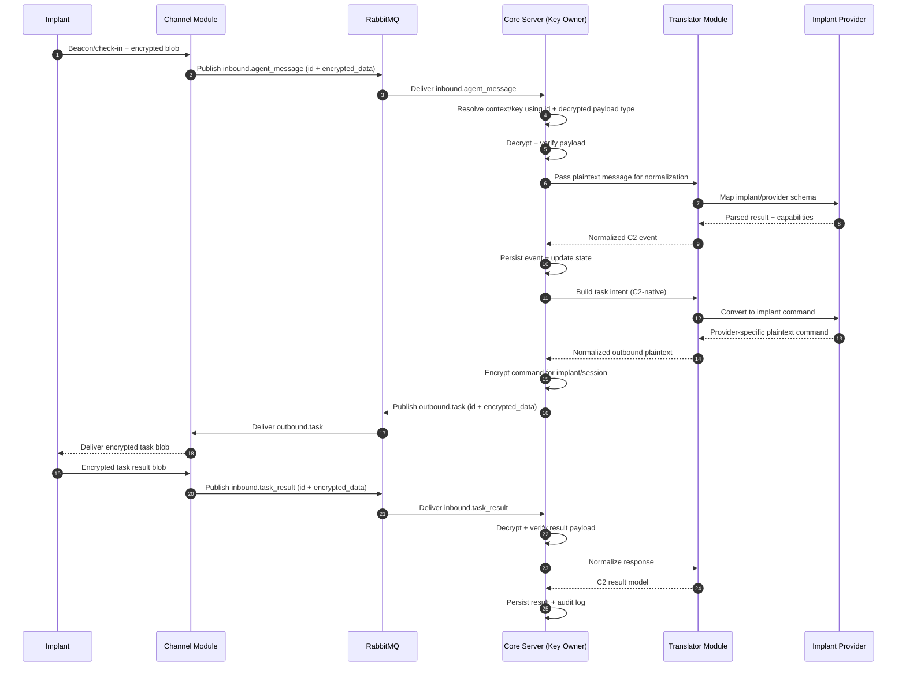
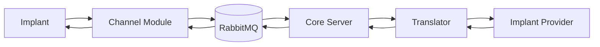

# Message Flow (Implant/Session ↔ C2)

This diagram documents how messages move between implants/sessions and core C2, with channels acting as transport-only relays.

## End-to-End Sequence

## Responsibility Map

## Notes

- The logical conversation is `implant/session ↔ core C2`.
- `Channel` handles transport delivery and minimal routing metadata (`id`) only.
- `Channel` shuffles encrypted data and does not decrypt or inspect implant plaintext.
- `Core Server` owns key resolution, decrypt/verify, encrypt/sign, orchestration, policy, persistence, and audit.
- `Translator` handles language/model conversion after core decrypts payload.
- `Implant Provider` handles implant family specifics (commands/build/capabilities).
- All inter-service traffic should carry `message_id` and `correlation_id`.
