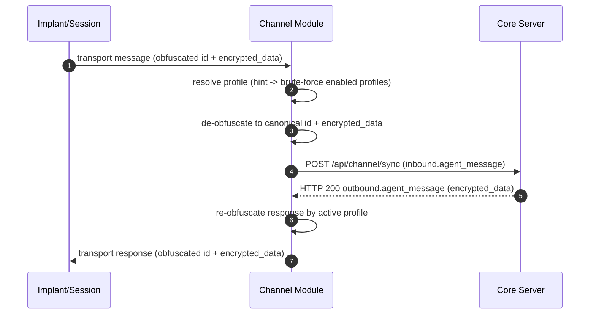

# Channel Message Flow (Isolated)

This page documents **channel-only** flow and responsibilities.

It intentionally excludes internal core processing layers such as translators and implant providers.

## Channel-Centric Sequence

## Channel Responsibilities

- Transport adaptation (HTTP/Telegram/etc.).
- Obfuscation profile resolution and mapping.
- Canonicalization to `id` + `encrypted_data`.
- Forwarding canonical request to core sync endpoint.
- Returning core response to implant/session in transport form.

## Channel Boundaries

- Channel does **not** decrypt payload plaintext.
- Channel does **not** execute core business logic.
- Channel does **not** own translator/implant-provider semantics.
