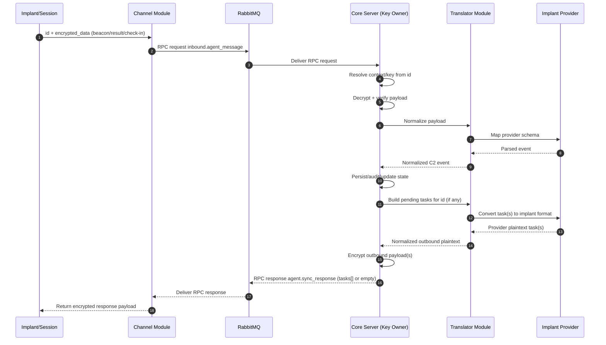

# Message Flow (Implant/Session ↔ C2)

This diagram documents how messages move between implants/sessions and core C2, with channels acting as transport-only relays.

## RPC Sequence (Channel ↔ Core)

## Delivery Semantics

- Channel initiates RPC when implant/session sends inbound traffic.
- Core always replies with `agent.sync_response`:
  - `tasks` may be empty (no work), or
  - contain one/many encrypted task blobs for the same `id`.
- No separate channel-consumed outbound task stream is required for this model.

## Notes

- The logical conversation is `implant/session ↔ core C2`.
- `Channel` handles transport and minimal routing metadata (`id`) only.
- `Channel` shuffles encrypted data and does not decrypt or inspect plaintext.
- `Core Server` owns key resolution, decrypt/verify, encrypt/sign, orchestration, policy, persistence, and audit.
