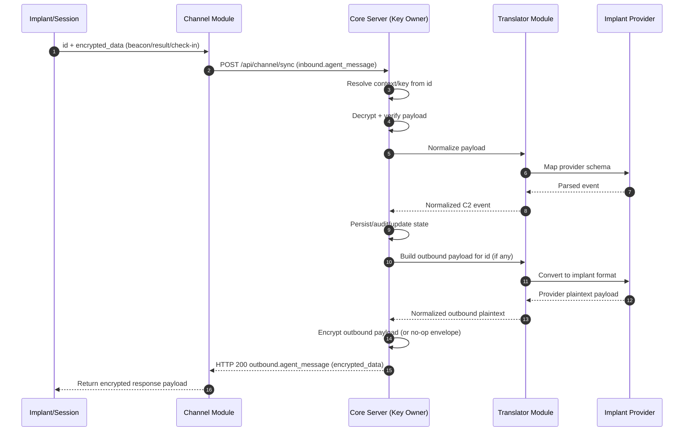

# Message Flow (Implant/Session ↔ C2)

This diagram documents how messages move between implants/sessions and core C2, with channels acting as transport-only relays.

## HTTP Sync Sequence (Channel ↔ Core)

## Delivery Semantics

- Channel initiates sync when implant/session sends inbound traffic.
- Core always replies with `outbound.agent_message`.
- Response body exposed to channel is encrypted-only (`encrypted_data`).
- If no work is available, core returns an empty/no-op encrypted payload.

## Notes

- The logical conversation is `implant/session ↔ core C2`.
- `Channel` handles transport and minimal routing metadata (`id`) only.
- `Channel` shuffles encrypted data and does not decrypt or inspect plaintext.
- `Core Server` owns key resolution, decrypt/verify, encrypt/sign, orchestration, policy, persistence, and audit.
