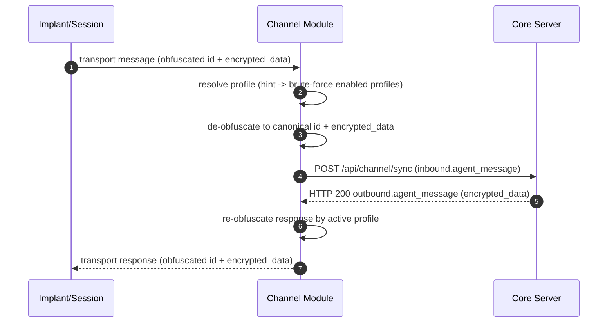

# Потік повідомлень каналу (ізольований)

Ця сторінка документує потік і відповідальності **лише на рівні каналу**.

Вона навмисно виключає внутрішні шари обробки ядра, такі як перекладачі та провайдери імплантів.

## Послідовність з точки зору каналу

## Відповідальності каналу

- Адаптація транспорту (HTTP/Telegram/тощо).
- Визначення та зіставлення профілю обфускації.
- Канонізація до `id` + `encrypted_data`.
- Передача канонічного запиту до кінцевої точки синхронізації ядра.
- Повернення відповіді ядра до імпланту/сесії у транспортній формі.

## Межі каналу

- Канал **не** розшифровує корисне навантаження у відкритий текст.
- Канал **не** виконує бізнес-логіку ядра.
- Канал **не** володіє семантикою перекладача/провайдера імплантів.
