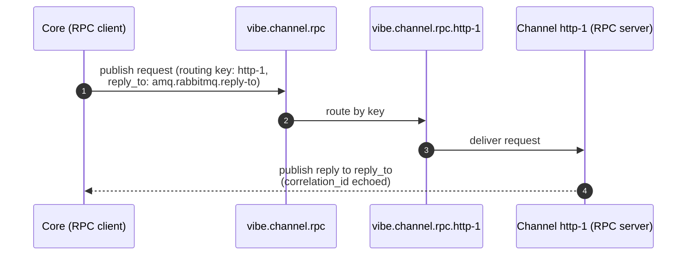

This page freezes the RabbitMQ exchange, queue, and routing-key naming strategy
for the control plane. It resolves the "exchange/queue naming conventions and
routing-key strategy" item from the [Architecture Draft](../../architecture/#pending-decisions)
and is recorded in [ADR-0002](../../adr/0002-amqp-contract-conventions/).

All names are lowercase, dot-separated, and prefixed with `vibe.` to namespace
the platform on a shared broker.

## Exchanges

| Exchange | Type | Purpose |
|---|---|---|
| `vibe.channel.rpc` | `direct` | Core → channel RPC requests (profile management). |
| `vibe.factory.rpc` | `direct` | Core ↔ minion-factory RPC (build coordination). |
| `vibe.events` | `topic` | Module → core event notifications (fan-in). |

RPC uses **direct** exchanges so a request is routed to exactly one target
instance by routing key. Events use a **topic** exchange so core can subscribe
to event classes with wildcards.

## RPC: request/reply

Core is the RPC **client**; the module is the RPC **server**. Each module
instance owns a durable request queue and consumes from it.

### Request queue

```
vibe.<module-type>.rpc.<instance>
```

bound to the matching RPC exchange with routing key `<instance>`.

Examples:

- `vibe.channel.rpc.http-1` bound to `vibe.channel.rpc` with key `http-1`
- `vibe.channel.rpc.telegram-2` bound to `vibe.channel.rpc` with key `telegram-2`

### Replies

Replies use RabbitMQ **direct reply-to** — the client sets the request's
`reply_to` property to the pseudo-queue `amq.rabbitmq.reply-to` and the server
publishes the reply to that address. The reply's `correlation_id` equals the
request's `correlation_id`. No per-call reply queue is declared.



### Message properties

In addition to the [envelope](../amqp-envelope/) body, RPC requests set standard
AMQP properties:

| Property | Value |
|---|---|
| `reply_to` | `amq.rabbitmq.reply-to` |
| `correlation_id` | same ULID as the envelope `correlation_id` |
| `content_type` | `application/json` |
| `type` | the envelope `type` (e.g. `transposition.profile.create`) |

## Events: publish/subscribe

Modules publish events to the `vibe.events` topic exchange. Routing keys are
hierarchical:

```
<module-type>.<instance>.<event>
```

Examples:

- `channel.http-1.profile.activated`
- `channel.http-1.profile.match_failed`
- `factory.go-1.build.completed`

Core binds subscriber queues with wildcards:

- `channel.*.profile.*` — all channel profile events
- `factory.*.build.*` — all factory build events
- `#` — everything (audit sink)

## Reliability

- **Durable** request queues and exchanges survive broker restart.
- **Dead-letter**: each RPC request queue declares a dead-letter exchange
  `vibe.dlx` (topic) for messages that are rejected or exceed delivery limits,
  satisfying the reliability requirement from
  [core-infrastructure.md](../../core-infrastructure/#rabbitmq--message-bus).
- **Per-queue ACLs** enforce trust boundaries: a channel instance may consume
  only its own RPC queue and publish only to `vibe.events`.

## Naming summary

| Kind | Pattern | Example |
|---|---|---|
| RPC exchange | `vibe.<surface>.rpc` | `vibe.channel.rpc` |
| RPC request queue | `vibe.<module-type>.rpc.<instance>` | `vibe.channel.rpc.http-1` |
| RPC routing key | `<instance>` | `http-1` |
| Event exchange | `vibe.events` | `vibe.events` |
| Event routing key | `<module-type>.<instance>.<event>` | `channel.http-1.profile.activated` |
| Dead-letter exchange | `vibe.dlx` | `vibe.dlx` |
