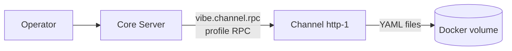

This is the **control-plane** contract between core and a channel module: how
core manages a channel's transposition profiles over RabbitMQ RPC. It is the
first AMQP contract specified for the platform.

It builds on the shared [AMQP envelope](../amqp-envelope/) and
[routing conventions](../amqp-conventions/). For the data-plane (minion traffic)
contract between the same parties, see
[Channel ↔ Core: HTTP Sync](../channel-core-sync/).

## Roles and ownership

- **Core is the RPC client.** It owns the management UX/API and policy decisions
  and issues profile operations on an operator's behalf.
- **The channel is the RPC server.** It owns runtime loading, validation,
  execution, and **on-disk persistence** of its profiles, and is the
  system-of-record for them.

There is no central profile database. Each channel instance stores its profiles
as YAML files on its own local disk. Persistence across restarts/redeploys is an
operational concern handled with **Docker volumes** mounted at the channel's
profile directory — not a core responsibility. Core never reads or writes
channel profile storage directly; it goes through this RPC contract.



## Transport

| Aspect | Value |
|---|---|
| Exchange | `vibe.channel.rpc` (direct) |
| Routing key | target channel `<instance>` (e.g. `http-1`) |
| Request queue | `vibe.channel.rpc.<instance>` |
| Reply | direct reply-to (`amq.rabbitmq.reply-to`), `correlation_id` echoed |
| Body | [AMQP envelope](../amqp-envelope/) / RPC reply envelope |

All operations are request/reply. The `type` field selects the operation. The
sections below specify each operation's request and reply `payload`; the
surrounding envelope is omitted for brevity.

## Operations

| `type` | Mutating | Summary |
|---|---|---|
| `transposition.profile.list` | no | List profile summaries for the channel. |
| `transposition.profile.get` | no | Fetch one full profile (YAML). |
| `transposition.profile.create` | yes | Add a new profile after validation. |
| `transposition.profile.update` | yes | Replace an existing profile after validation. |
| `transposition.profile.delete` | yes | Remove a profile. |
| `transposition.profile.activate` | yes | Enable/disable a profile. |
| `transposition.profile.validate` | no | Dry-run validate YAML without persisting. |
| `transposition.profile.simulate_match` | no | Test which profile a sample transport payload matches. |
| `transposition.profile.stats` | no | Return usage/selection statistics. |

Mutating operations are **idempotent on `message_id`**: a redelivered request
with the same `message_id` must not apply the change twice.

---

### `transposition.profile.list`

Request:

```json
{ "enabled_only": false }
```

Reply `payload`:

```json
{
  "profiles": [
    { "profile_id": "p-2b77df", "name": "http-cookie-v1", "enabled": true, "updated_at": "2026-06-20T20:00:00.000Z" },
    { "profile_id": "p-9c1a04", "name": "http-query-noise", "enabled": false, "updated_at": "2026-06-18T11:30:00.000Z" }
  ]
}
```

### `transposition.profile.get`

Request:

```json
{ "profile_id": "p-2b77df" }
```

Reply `payload`:

```json
{
  "profile_id": "p-2b77df",
  "name": "http-cookie-v1",
  "enabled": true,
  "yaml": "version: 1\nname: http-cookie-v1\nmapping:\n  ...",
  "updated_at": "2026-06-20T20:00:00.000Z"
}
```

Errors: `profile_not_found`.

### `transposition.profile.create`

Request:

```json
{ "yaml": "version: 1\nname: http-cookie-v1\nmapping:\n  ..." }
```

The channel parses the YAML, runs semantic validation, and runs overlap checks
against other **enabled** profiles for this channel before persisting it to disk.
The `profile_id` is assigned by the channel.

Reply `payload`:

```json
{ "profile_id": "p-2b77df", "name": "http-cookie-v1", "enabled": false }
```

Errors: `validation_failed`, `overlap_conflict`.

### `transposition.profile.update`

Request:

```json
{
  "profile_id": "p-2b77df",
  "yaml": "version: 1\nname: http-cookie-v1\nmapping:\n  ..."
}
```

Replaces the named profile after the same validation + overlap checks as create.

Reply `payload`:

```json
{ "profile_id": "p-2b77df", "name": "http-cookie-v1", "enabled": true }
```

Errors: `profile_not_found`, `validation_failed`, `overlap_conflict`.

### `transposition.profile.delete`

Request:

```json
{ "profile_id": "p-9c1a04" }
```

Reply `payload`:

```json
{ "profile_id": "p-9c1a04", "deleted": true }
```

Errors: `profile_not_found`.

### `transposition.profile.activate`

Request:

```json
{ "profile_id": "p-2b77df", "enabled": true }
```

Enabling re-runs overlap checks against the currently enabled set — a profile
that would ambiguously match an already-enabled profile is rejected.

Reply `payload`:

```json
{ "profile_id": "p-2b77df", "enabled": true }
```

Errors: `profile_not_found`, `overlap_conflict`.

### `transposition.profile.validate`

Dry-run validation. Parses and semantically validates the YAML and reports
overlap against enabled profiles, **without** persisting anything.

Request:

```json
{ "yaml": "version: 1\nname: http-cookie-v1\nmapping:\n  ..." }
```

Reply `payload`:

```json
{
  "valid": true,
  "overlaps": [],
  "warnings": []
}
```

On invalid YAML the reply is `status: error` with code `validation_failed`; on
overlap, `valid` is `false` and `overlaps` lists the conflicting `profile_id`s.

### `transposition.profile.simulate_match`

Tests which enabled profile a sample inbound transport payload would resolve to,
mirroring the channel's runtime selection (hint-first, then ordered candidates).

Request:

```json
{
  "transport": {
    "method": "POST",
    "headers": { "cookie": "sid=QkM4V1R..." },
    "query": {},
    "body": ""
  }
}
```

Reply `payload`:

```json
{
  "matched": true,
  "profile_id": "p-2b77df",
  "via": "profile_id_hint",
  "canonical": { "id": "s-2b77df", "encrypted_data": "QkM4V1R..." }
}
```

`via` is one of `profile_id_hint`, `affinity_cache`, `brute_force`. When nothing
matches, `matched` is `false` and `profile_id` is `null` (the channel rejects
unmatched payloads at runtime — there is no default profile).

### `transposition.profile.stats`

Request:

```json
{ "profile_id": "p-2b77df" }
```

`profile_id` is optional; omit it for channel-wide stats.

Reply `payload`:

```json
{
  "profiles": [
    {
      "profile_id": "p-2b77df",
      "match_count": 184213,
      "last_matched_at": "2026-06-20T21:04:58.000Z",
      "selection_source": { "hint": 180100, "affinity_cache": 4000, "brute_force": 113 }
    }
  ]
}
```

---

## Error codes

| Code | Meaning |
|---|---|
| `profile_not_found` | No profile with the given `profile_id` on this channel. |
| `validation_failed` | YAML failed parsing or semantic validation. |
| `overlap_conflict` | Create/update/activate would introduce an ambiguous match against an enabled profile. |
| `unknown_profile_id` | A referenced `profile_id` hint is not unique/resolvable in channel scope. |
| `internal_error` | Unexpected channel-side failure (storage I/O, etc.). |

Validation and overlap rules are defined in
[Channel Transposition Profiles](../../channel-transposition-profiles/#matching-conflict-and-performance-strategy).

## Auditing

Profile changes are security-relevant. Channels emit an event to `vibe.events`
on every successful mutation so core can record who/when/what
(see [routing conventions](../amqp-conventions/#events-publishsubscribe)):

- `channel.<instance>.profile.created`
- `channel.<instance>.profile.updated`
- `channel.<instance>.profile.deleted`
- `channel.<instance>.profile.activated`

Each event payload carries the `profile_id`, the originating `correlation_id`,
and the actor identity propagated by core in the triggering request.
