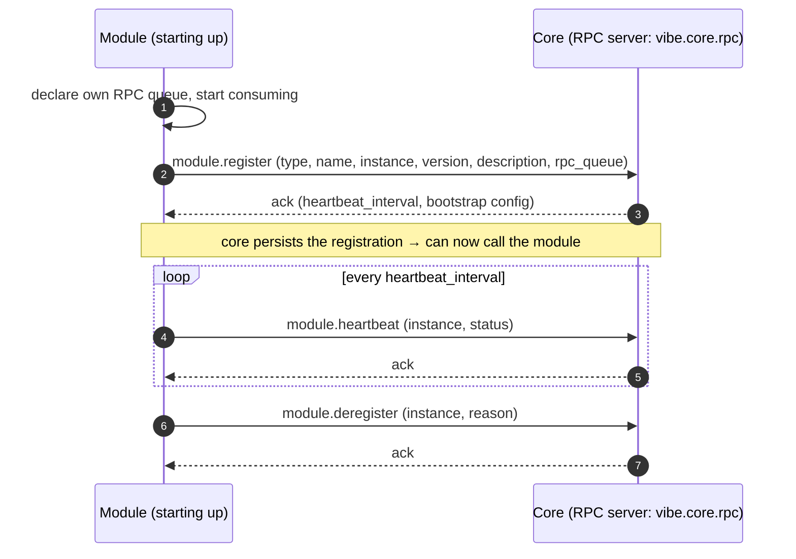
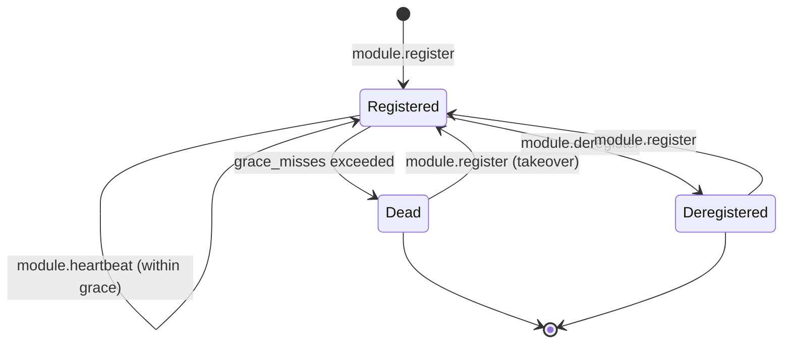

This is a **control-plane** contract shared by **all** module types — channels
and minion factories alike. It defines how a module announces itself to core,
proves it is alive, and leaves cleanly. It is the bootstrap that every other
control-plane contract depends on: core cannot issue management RPC to a module
until that module has registered.

It builds on the shared [AMQP envelope](../amqp-envelope/) and
[routing conventions](../amqp-conventions/), and the model is recorded in
[ADR-0003](../../adr/0003-module-registration-lifecycle/).

## Roles and direction

For lifecycle operations the **module is the RPC client** and **core is the RPC
server**. This is the opposite direction from management contracts like
[Channel ↔ Core: Profile RPC](../channel-core-rpc/), where core is the client.
The control plane is bidirectional; ownership is per-operation, not global.



## Transport

| Aspect | Value |
|---|---|
| Exchange | `vibe.core.rpc` (direct) |
| Routing key | `core` |
| Request queue | `vibe.core.rpc` (competing consumers across core instances) |
| Reply | direct reply-to (`amq.rabbitmq.reply-to`), `correlation_id` echoed |
| Body | [AMQP envelope](../amqp-envelope/) / RPC reply envelope |

All operations are request/reply. The `type` field selects the operation. The
sections below specify each operation's request and reply `payload`; the
surrounding envelope is omitted for brevity.

## Operations

| `type` | Summary |
|---|---|
| `module.register` | Announce a module instance and receive bootstrap config. |
| `module.heartbeat` | Prove liveness; refresh config if changed. |
| `module.deregister` | Leave gracefully (e.g. on shutdown). |

---

### `module.register`

Sent once on startup, after the module has declared its own RPC request queue and
begun consuming, so it is ready to serve management calls the moment core
acknowledges.

Request:

```json
{
  "module_type": "channel",
  "module_name": "http",
  "instance": "http-1",
  "version": "1.2.0",
  "rpc_queue": "vibe.channel.rpc.http-1",
  "description": "HTTPS/DNS C2 channel — primary beacon listener."
}
```

- `module_name` is the module's **hardcoded identity** — its project/kind
  (`http`, `dns`, `telegram`, `git`, ...), baked into the implementation and
  shared by every running instance of that module. It is not operator-selectable.
- `instance` is the **unique id of one deployed instance**, self-assigned by the
  module (e.g. from its env/config). Core does not mint it. An operator may run
  several instances of the same `module_name` (e.g. `http-channel-1`,
  `http-channel-2`); each must carry a distinct `instance`, since heartbeat,
  deregister, and management RPC all address a module by `instance` alone.
- `rpc_queue` tells core which queue to use when it acts as client toward this
  module (see [routing conventions](../amqp-conventions/#rpc-requestreply)).
- `description` is optional free-text the module reports about itself, surfaced
  on the admin Modules page.

Reply `payload`:

```json
{
  "instance": "http-1",
  "registered": true,
  "heartbeat_interval_seconds": 30,
  "heartbeat_grace_misses": 3,
  "config": {
    "policy": {},
    "feature_flags": {}
  }
}
```

Core persists the registration in its module registry (MongoDB) and may now issue
management RPC to `rpc_queue`.

**Re-registration is idempotent (takeover).** If an `instance` re-registers — for
example after a restart — core upserts the existing record and resumes; it does
not create a duplicate and does not error. The most recent registration wins.

Errors: `validation_failed` (malformed payload, or missing `module_type` /
`module_name` / `instance` / `rpc_queue`), `unsupported_version` (the request envelope's
contract major version is one core does not serve — enforced at the transport
layer for every RPC, not per-declared-contract).

### `module.heartbeat`

Sent every `heartbeat_interval_seconds` from the register ack. Core marks an
instance **dead** after `heartbeat_grace_misses` consecutive missed beats
(default 3 → 90s) and treats it as deregistered.

Request:

```json
{
  "instance": "http-1",
  "status": "healthy",
  "metrics": {
    "profiles_enabled": 4,
    "sync_in_flight": 2
  }
}
```

`status` is one of `healthy`, `degraded`, `draining`. `metrics` is an optional,
lightweight liveness snapshot — not a metrics-pipeline substitute.

Reply `payload`:

```json
{ "instance": "http-1", "ack": true, "config_changed": false }
```

When `config_changed` is `true`, the module should re-`register` (or a future
`module.get_config`) to pull the updated bootstrap config.

Errors: `unknown_instance` (no active registration — module should re-`register`).

### `module.deregister`

Sent on graceful shutdown so core can drop the instance from the active registry
immediately rather than waiting for heartbeats to lapse.

Request:

```json
{ "instance": "http-1", "reason": "shutdown" }
```

`reason` is free-form (`shutdown`, `redeploy`, `operator_request`, ...).

Reply `payload`:

```json
{ "instance": "http-1", "deregistered": true }
```

Errors: `unknown_instance`.

---

## Liveness state machine



Core stops issuing management RPC to an instance once it is `Dead` or
`Deregistered`, and resumes after a fresh `module.register`.

## Error codes

| Code | Meaning |
|---|---|
| `validation_failed` | Malformed lifecycle payload. |
| `unsupported_version` | Module declares a contract major version core cannot serve. |
| `unknown_instance` | Heartbeat/deregister for an instance with no active registration. |
| `internal_error` | Unexpected core-side failure (registry I/O, etc.). |

## Auditing

Core records lifecycle transitions in its audit log and may emit them onto
`vibe.events` for observers:

- `module.<instance>.registered`
- `module.<instance>.deregistered`
- `module.<instance>.declared_dead`
