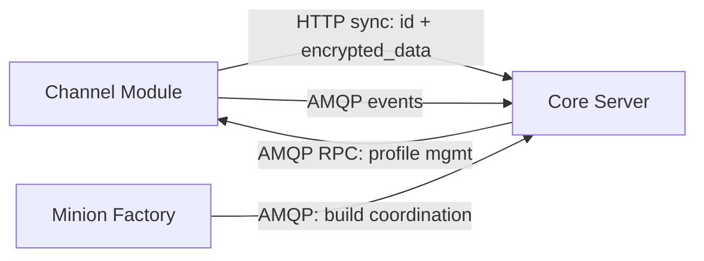

This section is the canonical home for the **contracts** between modules and the
core Server. A contract defines the wire format, transport, and semantics that
two components rely on to interoperate without sharing implementation.

## Two communication surfaces

Vibe C2 modules talk to core over two distinct surfaces. Each contract lives on
exactly one of them.

| Surface | Transport | Carries | Pattern |
|---|---|---|---|
| **Data plane** | HTTP (`POST /api/channel/sync`) | Minion traffic — opaque encrypted blobs | Request/response |
| **Control plane** | RabbitMQ (AMQP) | Module management, coordination, events | RPC + pub/sub |

- The **data plane** moves minion payloads. It is deliberately minimal and
  plaintext-blind: channels relay `id` + `encrypted_data` and never decrypt.
  See [Channel ↔ Core: HTTP Sync](../channel-core-sync/).
- The **control plane** carries everything else — profile management, build
  coordination, health/events. It never carries minion ciphertext. It is built
  on a shared [AMQP envelope](../amqp-envelope/) and
  [routing conventions](../amqp-conventions/).

## Shared rules

Every contract in this section, regardless of surface, follows the same baseline:

- **Versioning** — messages carry an explicit `version`. Consumers reject
  unknown major versions and tolerate additive minor changes.
- **Correlation** — every message carries a `message_id`; request/response and
  RPC exchanges also carry a `correlation_id` to tie a reply to its request.
- **Idempotency** — processing is idempotent where possible; redelivery of the
  same `message_id` must not double-apply side effects.
- **Crypto boundary** — minion payload crypto belongs to core C2 services only.
  Control-plane contracts never transport `encrypted_data`, and channels stay
  plaintext-blind on the data plane.

## Contracts in this section

| Contract | Surface | Parties | Status |
|---|---|---|---|
| [HTTP Sync](../channel-core-sync/) | Data plane | Channel ↔ Core | Specified |
| [Transposition Profile RPC](../channel-core-rpc/) | Control plane | Core (client) ↔ Channel (server) | Specified |

Foundational specs the control-plane contracts build on:

- [AMQP Message Envelope](../amqp-envelope/) — the shared base envelope.
- [AMQP Routing Conventions](../amqp-conventions/) — exchange/queue/routing-key naming.

The envelope and naming conventions are frozen in
[ADR-0002](../../adr/0002-amqp-contract-conventions/).
