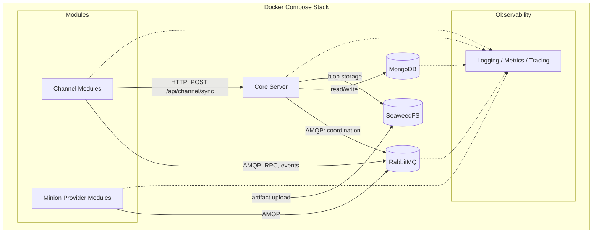

This page maps the infrastructure services that support the Vibe C2 platform at MVP scope. It covers what each service does, why it was chosen, and what connects to it.

For architectural rationale see the [Architecture Draft](../architecture/). For core server responsibilities see [Core Responsibilities](../core-responsibilities/).

## Infrastructure Topology

## RabbitMQ — Message Bus

- **Role**: asynchronous communication backbone between core server and all modules. Carries control-plane RPC (e.g. transposition profile CRUD), event notifications, and module coordination messages. Does **not** carry minion traffic — that flows via the HTTP sync endpoint.
- **Why RabbitMQ**: mature AMQP broker with exchange/queue routing patterns suited to module-type-based message routing, dead-letter queues for reliability ([FR-05](../tech-requirements/)), and per-queue ACLs for trust boundary enforcement.
- **Connections**: Core Server (publisher/consumer), Channel Modules, Minion Provider Modules — all communicate over AMQP.

## MongoDB — Persistence Layer

- **Role**: durable storage for operator accounts, minion registrations, task history, session state, audit logs, and transposition profile YAML documents.
- **Why MongoDB**: schema-flexible document model maps well to YAML profile storage and semi-structured audit/event data. Supports evolving MVP contracts without rigid schema migrations.
- **Connections**: Core Server is the primary read/write client.

:::note
MongoDB resolves the database engine decision listed as pending in the
[Architecture Draft](../architecture/#pending-decisions).
:::
## SeaweedFS — Blob Storage

- **Role**: distributed object/blob storage for large artifacts — minion build outputs from [Minion Provider Modules](../module-types/), staged payloads, and file exfiltration results.
- **Why SeaweedFS**: lightweight, self-hosted, S3-compatible API. Avoids external cloud dependencies and keeps binary blobs out of the document database.
- **Connections**: Core Server (read/write), Minion Provider Modules (artifact upload).

## Docker Compose — Deployment Orchestration

- **Role**: defines and runs the complete MVP service topology as a single declarative stack. All services — core server, RabbitMQ, MongoDB, SeaweedFS, modules, observability — run as containers managed by Compose.
- **Why Docker Compose**: matches the [tech-requirements.md](../tech-requirements/) constraint ("Runtime architecture is containerized and orchestrated with Docker Compose for MVP"). Simple single-host deployment without Kubernetes complexity.
- **Topology**: single `docker-compose.yml` on an internal Docker network. External exposure is limited to operator/API ports and channel listener ports, optionally behind a reverse proxy for TLS termination (see [Architecture Draft](../architecture/#initial-deployment-shape)).

## Observability Stack

- **Role**: centralized collection of logs, metrics, and traces from all services. Supports auditability requirements ([FR-09](../tech-requirements/)) and operational reliability targets.
- **Components**: structured logging aggregation, metrics collection, and distributed tracing. Specific tooling (e.g. Prometheus, Grafana, Loki) is not yet prescribed — this section captures the role, not the implementation.
- **Connections**: all services emit structured logs and health signals. Core server and modules expose health/metrics endpoints. The observability stack scrapes/collects from all containers.

## Service Communication Summary

| From | To | Protocol | Purpose |
|---|---|---|---|
| Core Server | RabbitMQ | AMQP | Module coordination, RPC, events |
| Channel Modules | RabbitMQ | AMQP | Profile management RPC, event publishing |
| Minion Providers | RabbitMQ | AMQP | Build coordination |
| Channel Modules | Core Server | HTTP | Minion sync (`POST /api/channel/sync`) |
| Core Server | MongoDB | MongoDB wire protocol | State persistence, audit logs |
| Core Server | SeaweedFS | HTTP (S3-compatible) | Artifact storage and retrieval |
| Minion Providers | SeaweedFS | HTTP (S3-compatible) | Artifact upload |
| All services | Observability | Structured logs / metrics | Monitoring and audit |
