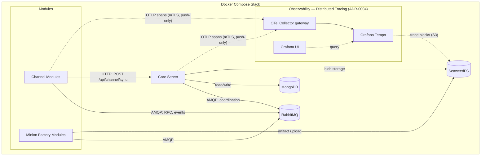

This page maps the infrastructure services that support the Vibe C2 platform at MVP scope. It covers what each service does, why it was chosen, and what connects to it.

For architectural rationale see the [Architecture Draft](../architecture/). For core server responsibilities see [Core Responsibilities](../core-responsibilities/).

## Infrastructure Topology

:::note
Trace export is **push-only** from the data-plane services (channel, core) to
the collector — never through core, never from minion factories (build-time only
at MVP), and never from the minion. Context rides existing edges as W3C
`traceparent` (HTTP `sync` header, AMQP headers). See
[ADR-0004](../adr/0004-distributed-tracing-minion-data-plane/) for the full
rationale and trust boundary.
:::

## RabbitMQ — Message Bus

- **Role**: asynchronous communication backbone between core server and all modules. Carries bidirectional control-plane RPC — module lifecycle (register/heartbeat/deregister, module→core) and management (e.g. transposition profile CRUD, core→module) — plus event notifications and coordination messages. Does **not** carry minion traffic — that flows via the HTTP sync endpoint.
- **Why RabbitMQ**: mature AMQP broker with exchange/queue routing patterns suited to module-type-based message routing, dead-letter queues for reliability ([FR-05](../tech-requirements/)), and per-queue ACLs for trust boundary enforcement.
- **Connections**: Core Server (publisher/consumer), Channel Modules, Minion Factory Modules — all communicate over AMQP.

## MongoDB — Persistence Layer

- **Role**: durable storage for operator accounts, minion registrations, the **module registry** (registered channel/factory instances and their lifecycle state), task history, session state, and audit logs.
- **Why MongoDB**: schema-flexible document model maps well to semi-structured audit/event data. Supports evolving MVP contracts without rigid schema migrations.
- **Connections**: Core Server is the primary read/write client.

:::note
MongoDB does **not** store transposition profiles. Each channel module owns its
profiles as YAML files on local disk, persisted with Docker volumes. Core manages
them only through the [profile RPC contract](../contracts/channel-core-rpc/). See
[ADR-0002](../adr/0002-amqp-contract-conventions/).
:::

:::note
MongoDB resolves the database engine decision listed as pending in the
[Architecture Draft](../architecture/#pending-decisions).
:::
## SeaweedFS — Blob Storage

- **Role**: distributed object/blob storage for large artifacts — minion build outputs from [Minion Factory Modules](../module-types/), staged payloads, and file exfiltration results.
- **Why SeaweedFS**: lightweight, self-hosted, S3-compatible API. Avoids external cloud dependencies and keeps binary blobs out of the document database.
- **Connections**: Core Server (read/write), Minion Factory Modules (artifact upload).

## Docker Compose — Deployment Orchestration

- **Role**: defines and runs the complete MVP service topology as a single declarative stack. All services — core server, RabbitMQ, MongoDB, SeaweedFS, modules, observability — run as containers managed by Compose.
- **Why Docker Compose**: matches the [tech-requirements.md](../tech-requirements/) constraint ("Runtime architecture is containerized and orchestrated with Docker Compose for MVP"). Simple single-host deployment without Kubernetes complexity.
- **Topology**: single `docker-compose.yml` on an internal Docker network. External exposure is limited to operator/API ports and channel listener ports, optionally behind a reverse proxy for TLS termination (see [Architecture Draft](../architecture/#initial-deployment-shape)).

## Observability Stack

- **Role**: at MVP scope the observability stack delivers **distributed tracing of the minion data plane** only — the server-side handling of a single minion request across channel, core, and (in future) the minion factory. Decided in [ADR-0004](../adr/0004-distributed-tracing-minion-data-plane/). **Audit logging ([FR-09](../tech-requirements/)) and metrics remain deferred** ([future-steps](../future-steps/)).
- **Components**: **OpenTelemetry Go SDK** in the traced services → **OpenTelemetry Collector (contrib)** gateway → **Grafana Tempo** for storage → **Grafana** for trace search and waterfall views. Operator/API/UI control-plane actions are **not** traced.
- **Trace storage**: Tempo persists trace blocks in **SeaweedFS** via its S3-compatible backend, reusing the object storage the platform already runs — no new database and no external cloud dependency. Tempo uses a dedicated bucket and trace-only-scoped credentials.
- **Connections**: the data-plane services (channel, core) **push** spans to the collector over OTLP/mTLS on a dedicated observability segment. The collector is the only component that reaches the backend; nothing flows back to a module, and spans never traverse core or the AMQP control plane. Trace context propagates as W3C `traceparent` over the existing HTTP sync and AMQP edges. The minion never participates — the channel mints a fresh root and discards any inbound trace context.

## Service Communication Summary

| From | To | Protocol | Purpose |
|---|---|---|---|
| Core Server | RabbitMQ | AMQP | Module coordination, RPC, events |
| Channel Modules | RabbitMQ | AMQP | Profile management RPC, event publishing |
| Minion Factories | RabbitMQ | AMQP | Build coordination |
| Channel Modules | Core Server | HTTP | Minion sync (`POST /api/channel/sync`) |
| Core Server | MongoDB | MongoDB wire protocol | State persistence, audit logs |
| Core Server | SeaweedFS | HTTP (S3-compatible) | Artifact storage and retrieval |
| Minion Factories | SeaweedFS | HTTP (S3-compatible) | Artifact upload |
| Channel Modules, Core Server | OTel Collector | OTLP spans (mTLS, push-only) | Distributed tracing of the minion data plane (ADR-0004) |
| Grafana Tempo | SeaweedFS | HTTP (S3-compatible) | Trace block storage |
