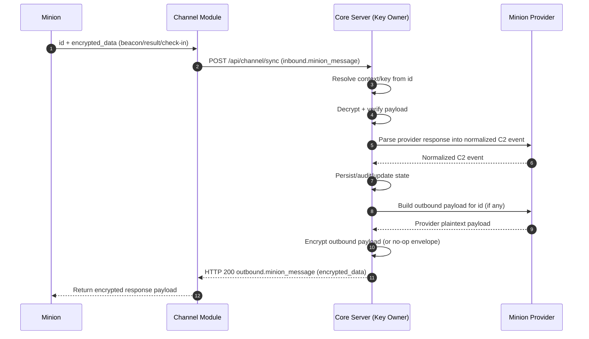

This page documents the end-to-end flow across all major components:

- Minion
- Channel Module
- Core Server
- Minion Provider Module

## End-to-End Sequence

## Notes

- `minion ↔ core C2` is the logical protocol conversation.
- Channel is a transport relay and remains plaintext-blind.
- Minion Provider is an internal core-side processing layer.
