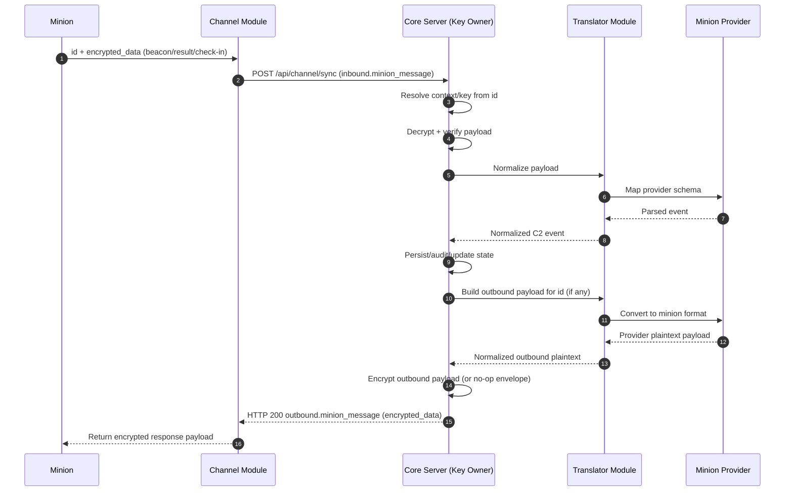

This page documents the end-to-end flow across all major components:

- Minion
- Channel Module
- Core Server
- Translator Module
- Minion Provider Module

## End-to-End Sequence

## Notes

- `minion ↔ core C2` is the logical protocol conversation.
- Channel is a transport relay and remains plaintext-blind.
- Translator and Implant Provider are internal core-side processing layers.
