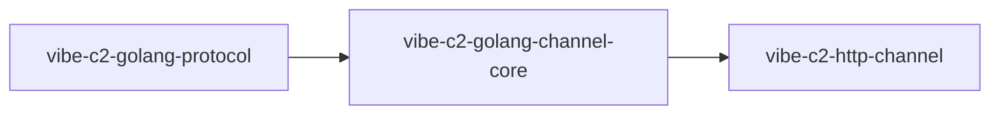

Цей розділ відстежує офіційні Go-пакети в екосистемі Vibe C2.

## Доступні пакети

- [`vibe-c2-golang-protocol`](../golang-package-protocol/)
- [`vibe-c2-golang-channel-core`](../golang-package-channel-core/)
- [`vibe-c2-http-channel`](../golang-package-http-channel/)
- [`vibe-c2-telegram-channel`](../golang-package-telegram-channel/)

## Взаємозв'язок пакетів

## Примітки

- Ці пакети є основою для розробки модулів спільнотою.
- Цільовий досвід: учасники повинні мати змогу створювати нові канальні модулі з мінімальним шаблонним кодом.
